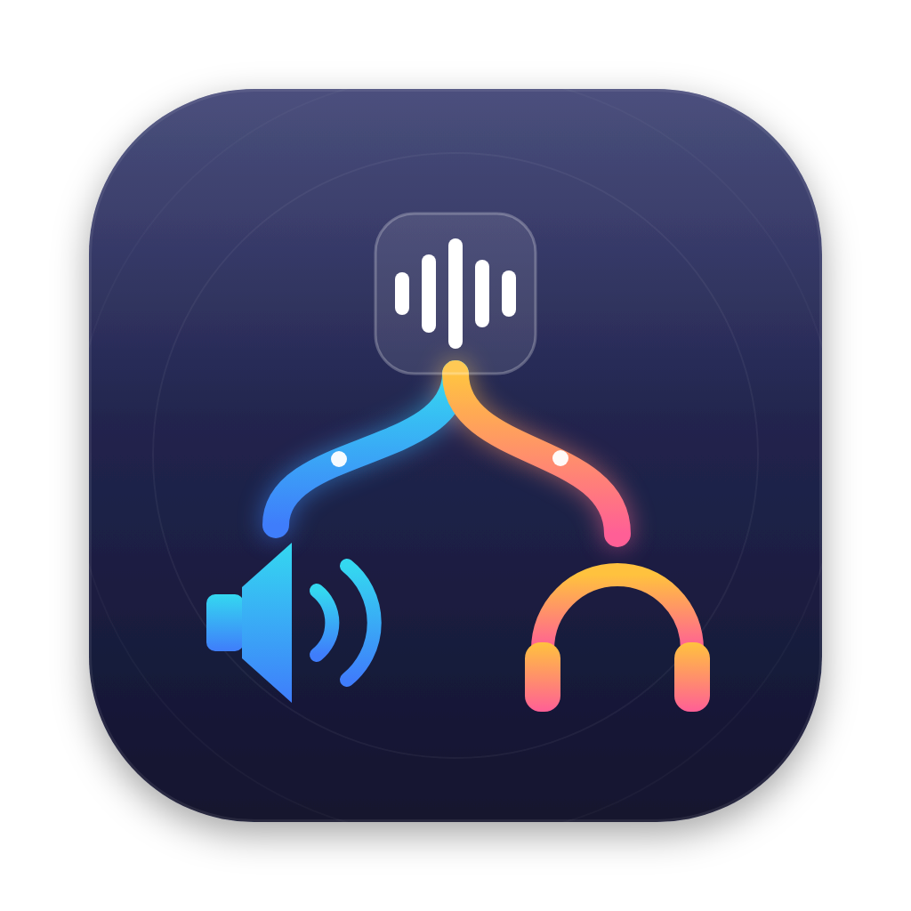
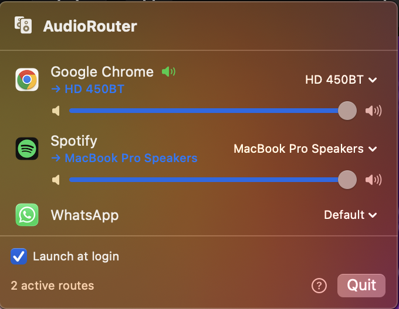

<p align="center">
  
</p>

<h1 align="center">AudioRouter</h1>

<p align="center">
  <b>Send every app's audio to a different output — at the same time.</b><br>
  Spotify on the living-room speaker. YouTube in your headphones. Simultaneously.
</p>

<p align="center">
  
  
  
</p>

<p align="center">
  
</p>

---

macOS lets you pick **one** output device for everything. AudioRouter removes that limit: assign each app its own speaker, headphones, USB DAC, or AirPlay device, straight from the menu bar — no kernel extensions, no virtual audio drivers, no configuration files. It's built on Apple's modern Core Audio *process tap* API (macOS 14.4+).

## Features

- 🔀 **Per-app routing** — each app can play through a different output device, simultaneously
- 💾 **Rules that stick** — assignments are remembered and re-apply automatically, even after a reboot
- 🎚️ **Per-app volume** — every routed app gets its own volume slider, independent of system volume
- 🔌 **Graceful fallback** — if a device disconnects, audio falls back to the system default (and the menu shows exactly where it's playing); the route resumes when the device returns
- 🚀 **Launch at login** — one checkbox
- 🪶 **Tiny and native** — a single Swift menu bar app; no Electron, no background daemons

## Install

### Homebrew (recommended)

```sh
brew tap abhisekganguly/tap
brew install --cask --no-quarantine audiorouter
```

> `--no-quarantine` skips Gatekeeper's "unverified developer" warning — AudioRouter is open source but not notarized (no Apple Developer subscription). Omit the flag if you prefer to approve the app manually via System Settings.

### Manual download

1. Download the latest `AudioRouter-x.y.z.zip` from [Releases](https://github.com/AbhisekGanguly/AudioRouter/releases) and unzip into `/Applications`.
2. On first open, macOS will block the app ("Apple could not verify…"). Go to **System Settings → Privacy & Security**, scroll down, and click **Open Anyway**. This is a one-time step.

## First launch

- A short welcome guide explains everything (reopen it anytime via the **?** button in the menu).
- The first time you route an app, macOS asks for **System Audio Recording** permission. AudioRouter needs it to capture an app's audio and redirect it — nothing is recorded or stored, and the code is right here to verify.
- While a route is active, macOS shows its standard audio-capture indicator in the menu bar. That's expected.

## How it works

For every "app → device" rule, AudioRouter creates a [Core Audio process tap](https://developer.apple.com/documentation/coreaudio/audiohardwarecreateprocesstap(_:_:)) on the app's audio, wraps it in a private aggregate device whose real sub-device is your chosen output, and copies the tapped samples into that device's buffers in a realtime IO callback (with the per-app gain applied). The tap mutes the app's original output only while the route is actively pulling audio, and leaked routes from crashes are cleaned up on the next launch — so no app is ever left silently muted.

## Limitations

- **Spotify Connect / Chromecast-style pickers bypass the Mac.** If you select a speaker inside an app itself, that audio streams directly over the network and never touches macOS — AudioRouter can't route it. Pick AirPlay devices from AudioRouter instead; they appear as normal output devices.
- Stereo output is the well-tested path; exotic multichannel interfaces may not map channels perfectly yet.
- macOS 14.4 or later (the process-tap API doesn't exist before that).

## Build from source

Requires Xcode command line tools.

```sh
git clone https://github.com/AbhisekGanguly/AudioRouter.git
cd AudioRouter
./scripts/build-app.sh
open build/AudioRouter.app
```

`scripts/make-icon.sh` regenerates the app icon from `Support/AppIcon.svg`; `scripts/release.sh` builds a release zip and prints its SHA-256 for the Homebrew cask.

## License

[MIT](LICENSE) © 2026 Abhisek Ganguly
